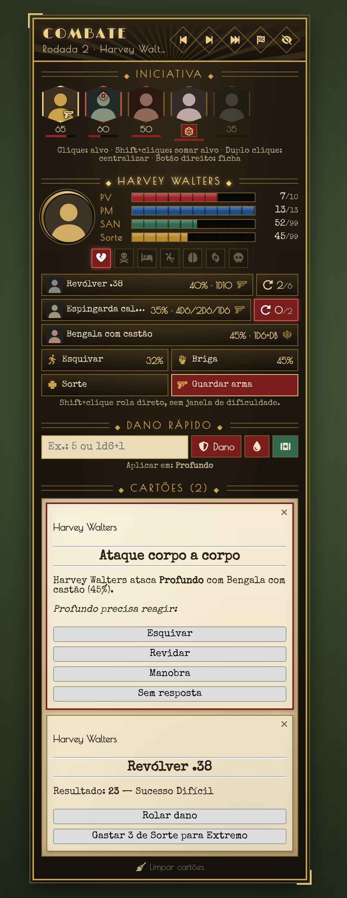

# Combat Cthulhu HUD

HUD de combate para **Foundry VTT v13** com o sistema **Call of Cthulhu 7th Edition (CoC7) 8.14+**, com visual retrô dos anos 20 (Art Déco).



## O que faz

- **Iniciativa**: retratos na ordem do combate, com destaque para quem está no turno. Clique marca o alvo (Shift soma alvos), duplo clique centraliza no token e o botão direito abre a ficha. Mostra a arma de fogo em punho e respeita a regra opcional de iniciativa do CoC7 (nível de sucesso).
- **Investigador em foco**: barras de PV, PM, SAN e Sorte, além das condições do CoC7 (ferimento grave, morrendo, inconsciente, caído, insanidades e morto). As condições podem ser ligadas e desligadas com um clique.
- **Ações rápidas**: atacar com cada arma do personagem, usando o fluxo original do CoC7 (corpo a corpo ou à distância, contra o alvo selecionado). Armas de fogo mostram a munição (ex.: 4/6) e têm botão de **recarregar**: clique enche o pente, Shift+clique põe uma bala e o botão direito tira uma. Também tem Esquivar, as perícias de Lutar, teste de Sorte, rolar iniciativa e sacar/guardar arma. Com Shift+clique a rolagem sai direto, sem a janela de dificuldade.
- **Dano rápido**: aceita um valor fixo ou uma fórmula (`1d6+1`). Aplica dano com armadura, dano direto ou cura nos alvos selecionados, usando a lógica do CoC7 (ferimento grave, morte etc.).
- **Cartões do sistema no HUD**: os cartões de combate que o CoC7 envia ao chat aparecem no HUD e **funcionam lá**. Isso vale para ataque corpo a corpo e à distância, esquivar/revidar/manobra, rolar dano, gastar sorte, forçar teste, testes de SAN/CON e testes opostos. Opcionalmente, eles podem ser escondidos do chat.
- Mestre e jogadores usam o HUD. Cada jogador vê o próprio investigador, e os PNJs aparecem só com nome e retrato.
- Sistema de **skins**: por enquanto só existe "Anos 20". Novas skins são só um bloco de variáveis CSS.

## Instalação

No Foundry: **Add-on Modules → Install Module**. Cole a URL de manifesto:

```
https://github.com/juninhoneiva/combatcthud/releases/latest/download/module.json
```

Ative o módulo no mundo. O HUD aparece quando existe um combate na cena.

- **Shift+H** mostra ou oculta o HUD. Também há um botão nos controles de Token.
- Para mover o HUD, arraste pelo cabeçalho. A posição fica salva.
- As opções ficam em **Configurações → Combat Cthulhu HUD**.

## Publicar uma versão

1. Aumente `version` no `module.json` e descreva a versão no `CHANGELOG.md` (seção `## vX.Y.Z`).
2. Faça o merge na `main`.
3. Publique de uma destas formas:
   - envie a tag: `git tag vX.Y.Z && git push origin vX.Y.Z`. O release é criado sozinho, com as notas do CHANGELOG;
   - ou crie um **Release** no GitHub com a tag `vX.Y.Z`.
4. O workflow `.github/workflows/release.yml` grava a versão no `module.json`, gera o `module.zip` e anexa os dois ao release. O Foundry passa a oferecer a atualização.

## Nova skin

1. Em `styles/combatcthud.css`, copie o bloco `.combatcthud.skin-noir20 { ... }` com o nome da nova skin, por exemplo `skin-pulp`, e troque as cores e as fontes.
2. Em `scripts/constants.js`, adicione a skin em `SKINS` e crie a tradução em `lang/*.json` (`COMBATCTHUD.Skins.<id>`).

## Estrutura

```
module.json           manifesto
scripts/main.js       hooks e inicialização
scripts/hud.js        aplicação (ApplicationV2) do HUD
scripts/cards.js      cartões do CoC7 renderizados no HUD
scripts/actor-data.js leitura de PV/PM/SAN/Sorte, condições, armas e perícias
templates/hud.hbs     layout
styles/               visual e fontes
lang/                 pt-BR e en
```

## Créditos

Fontes: Limelight e Poiret One (SIL OFL 1.1) e Special Elite (Apache 2.0).
