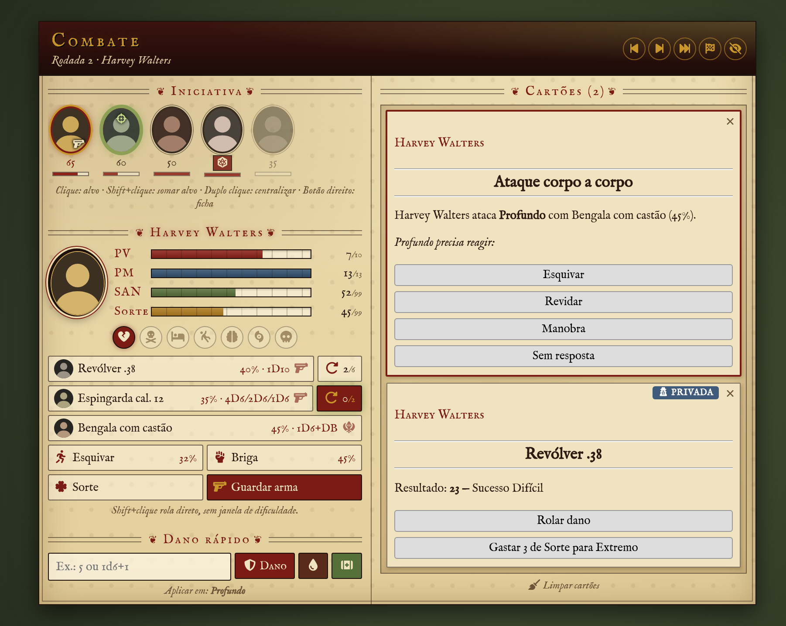
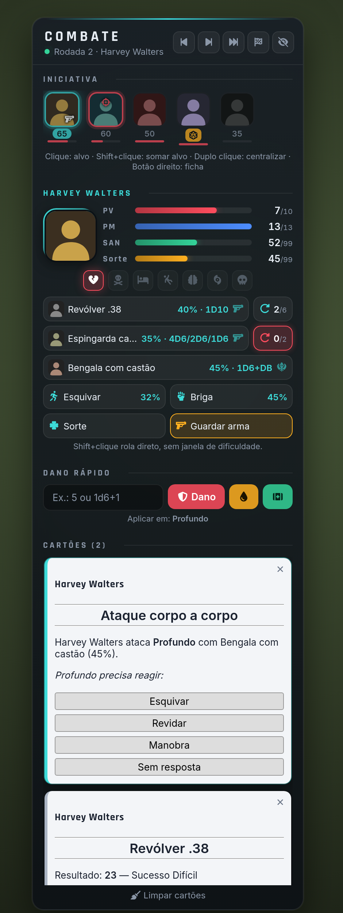

# Combat Cthulhu HUD

HUD de combate para **Call of Cthulhu 7ª Edição** no **Foundry VTT**. Reúne num só painel tudo o que importa na hora da luta: ordem de iniciativa, atributos do investigador, ataques, munição, dano e os próprios cartões de combate do sistema, prontos para usar.

<p>
  
</p>

## Requisitos

- Foundry VTT **v13**
- Sistema **Call of Cthulhu 7th Edition (CoC7)** 8.14 ou superior
- Opcional: [PopOut!](https://github.com/League-of-Foundry-Developers/fvtt-module-popout), para abrir o HUD numa janela separada

## Instalação

Em **Add-on Modules → Install Module**, cole a URL de manifesto:

```
https://github.com/juninhoneiva/combatcthud/releases/latest/download/module.json
```

Depois, ative o módulo no mundo. O HUD aparece sempre que houver um combate na cena.

## Recursos

### Iniciativa

- Retratos dos combatentes na ordem do turno, com destaque para quem está agindo.
- **Clique** marca o alvo (**Shift+clique** soma alvos), **duplo clique** centraliza no token e **botão direito** abre a ficha.
- Mostra quem está com arma de fogo em punho e respeita a regra opcional de iniciativa do CoC7 (nível de sucesso).

### Investigador

- Barras de **PV, PM, SAN e Sorte**.
- Condições do CoC7: ferimento grave, morrendo, inconsciente, caído, insanidade temporária, insanidade indefinida e morto. Ligam e desligam com um clique.
- Mestre e jogadores usam o HUD. Cada jogador vê o próprio investigador.
- **PV privados**: o mestre vê os pontos de vida de todos; cada jogador vê só os dos investigadores que controla. PNJs e outros jogadores aparecem apenas com nome e retrato.

### Ações rápidas

- **Atacar** com cada arma do personagem, usando o fluxo original do CoC7 (corpo a corpo ou à distância, contra o alvo selecionado).
- **Munição**: armas de fogo mostram as balas no pente (ex.: `4/6`).
  - Clique no botão de recarregar enche o pente e anuncia no chat.
  - Shift+clique põe uma bala.
  - Botão direito tira uma bala.
- **Esquivar**, perícias de **Lutar**, teste de **Sorte**, **rolar iniciativa** e **sacar/guardar arma**.
- **Shift+clique** em ataques e testes rola direto, sem a janela de dificuldade.

### Dano rápido

- Aceita um valor fixo ou uma fórmula (ex.: `1d6+1`).
- Três modos: dano com armadura, dano direto e cura.
- Aplica nos alvos selecionados, usando as regras do CoC7 (ferimento grave, morte etc.).

### Cartões do sistema no HUD

Os cartões de combate que o CoC7 envia ao chat aparecem numa coluna à direita do HUD e **funcionam ali mesmo**:

- ataques corpo a corpo e à distância;
- esquivar, revidar e manobra;
- rolar dano, gastar sorte e forçar teste;
- testes de SAN, de CON e opostos.

Os cartões respeitam o tipo de rolagem (o mestre sempre vê tudo):

| Rolagem | Quem vê no HUD |
| --- | --- |
| Pública | Todos, com os resultados dos dados abertos |
| Privada | O mestre e quem rolou |
| Cega | O mestre; quem rolou vê o cartão sem os resultados |
| Só para mim | O mestre e quem rolou |

A cada rodada o HUD limpa os cartões antigos e fica só com os da jogada atual. No chat eles continuam todos. Opcionalmente, os cartões exibidos no HUD podem ser escondidos do chat.

### Skins

| Skin | Estilo |
| --- | --- |
| **Anos 20** | Art Déco em preto e dourado |
| **Pulp** | Revista de horror pulp dos anos 30, no estilo Weird Tales |
| **Moderna** | HUD tático de vidro fosco |

<p>
  
  
</p>

Cada usuário escolhe a sua skin; mestre e jogadores podem usar skins diferentes.

## Uso

- **Shift+H** mostra ou oculta o HUD. Também há um botão nos controles de Token.
- Arraste o HUD pelo cabeçalho para mudá-lo de lugar. A posição fica salva.
- Clique no título de uma seção para recolhê-la ou expandi-la.
- **Janela separada**: com o módulo [PopOut!](https://github.com/League-of-Foundry-Developers/fvtt-module-popout) ativo, o botão <i>abrir em janela separada</i> no cabeçalho destaca o HUD numa janela própria, ideal para um segundo monitor. O mesmo botão o traz de volta. Também dá para definir um atalho em **Configurar Controles**.

## Configurações

Em **Configurações → Combat Cthulhu HUD**:

| Opção | Descrição | Padrão |
| --- | --- | --- |
| Exibir HUD de combate | Liga ou desliga o HUD neste navegador | Ligado |
| Somente durante combate | Mostra o HUD apenas com um encontro ativo na cena | Ligado |
| Visual | Skin do HUD | Anos 20 |
| Cartões no HUD | Quantos cartões do CoC7 ficam no HUD (0 desativa) | 3 |
| Limpar cartões do HUD | Tira do HUD os cartões antigos a cada rodada, a cada turno ou nunca | A cada rodada |
| Esconder do chat os cartões exibidos no HUD | Evita ver o mesmo cartão duas vezes | Desligado |
| Jogadores podem usar o dano rápido | Libera o dano rápido aos jogadores, só nos atores deles (opção do mundo) | Desligado |

## Idiomas

Português (Brasil) e inglês.

## Créditos e licença

Código sob licença [MIT](LICENSE).

Fontes incluídas: Limelight, Poiret One, IM Fell English, Rajdhani e Inter (SIL Open Font License 1.1) e Special Elite (Apache 2.0). As licenças estão em [`fonts/`](fonts).

Call of Cthulhu é marca registrada da Chaosium Inc. Este módulo não é afiliado à Chaosium.
